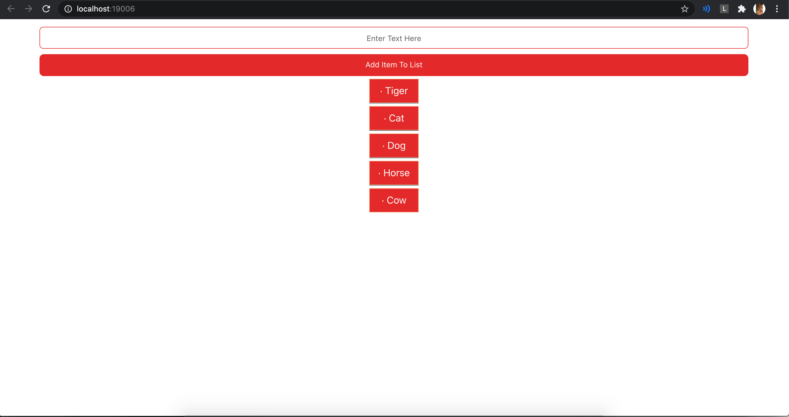

### TodoList-DB-ReactNative

[](https://travis-ci.org/joemccann/dillinger)<br>
A simple list of tasks, based on a relational database. The data is processed by the proprietary REST API.<br>

<p align="center">
<br>
<br>
</p>
# Technology

- [REST API] We have two api at our disposal - placed on Node.js and on Tornado - Python. Download links below :)<br>
- [Expo CLI] The interface for building a react native application, which I used to build IOS and Web applications.<br>

Other:

- [Postman] - Testing

```sh
$ git clone https://github.com/Dursky/ReactNative-API.git
$ cd ReactNative-API
$ npm start
$ or
$ code .
$ Click for debug section next run it.

```

# REST API specification

Tornado Python REST API link:<br>
https://github.com/Dursky/Tornado-REST-API

Node.js REST API link:<br>
https://github.com/Dursky/Node-REST-API

# What next ?

[x] Append element to list <br>
[x] Remove element from list <br>
[o] Plug API to project <br>
[o] Generate new DB <br>
[o] Append data to databse<br>
[o] Remove data from database<br>
